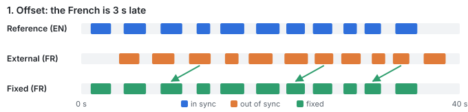
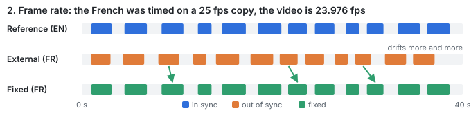
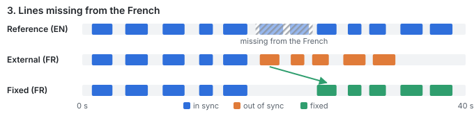
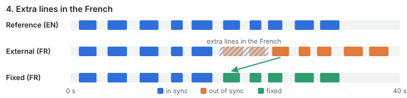
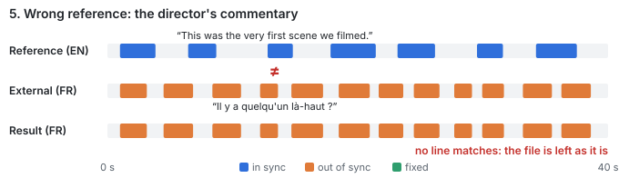

**English** | [Français](README.fr.md)

# SemanticSubSync

Fix the timing of a subtitle by comparing **what is said**, line by line, with a subtitle that is
already in sync, even when the two are in different languages.

```bash
semantic-subsync Movie.fr.srt Movie.mkv     # reference: the subtitle embedded in the video
```

## At a glance

One example, built for this project ([`examples/lighthouse`](examples/lighthouse)): the same
subtitle files given to each tool, with a reference subtitle that is in sync with the video.

| Tool | Scene missing + 25 fps | Extra scene | Wrong reference (commentary track) |
|---|---|---|---|
| alass 2.0.0 | ✅ 100 % | ❌ 87 %, up to 17 s off | ❌ moves lines by up to 96 s |
| ffsubsync 0.5.1 (with or without `--split-penalty`) | ❌ 52 %, 70-81 s off | ❌ 52 %, 61-70 s off | ❌ moves lines by up to 96 s |
| LAPSE 2.2.3 | ❌ 52 %, 70 s off, says "solid" | ❌ 52 %, 70 s off, says "solid" | ❌ moves lines by up to 75 s, says "solid" |
| **SemanticSubSync** | ✅ **100 %** | ✅ **100 %** | ✅ **refuses, file left alone** |

Share of lines that end up within 300 ms of their true position, on this example only: the
figures describe these files, not every video. Details and scripts to rerun it are in the
example folder.

## Why this project exists

Subtitles downloaded for a movie or an episode are often made for another release of the same
video: another frame rate (23.976 vs 25 fps), a scene added or cut, a different intro. The
result is a subtitle that drifts, or that is fine for 20 minutes and then off by 4 seconds.

The usual tools align on the **audio** (ffsubsync, alass in audio mode) or on the **timing
pattern** of another subtitle (alass, ffsubsync with a subtitle reference). In our tests:

- they often failed on cuts and inserted scenes;
- they **rarely said when they failed**: a subtitle moved by a minute or more could still be
  reported as a success.

Yet most videos already carry a perfectly timed subtitle: the embedded track, often in the
original language. SemanticSubSync uses it as a reference and matches lines **by meaning**
with a small multilingual sentence model: "Where did you put the keys?" and "Où as-tu mis les
clés ?" are recognized as the same line. When too few lines match (wrong reference, commentary
track, different cut), it **refuses** and leaves the file alone.

## Example

A French subtitle was downloaded for a 10-minute episode (an
[original dialogue](examples/lighthouse) written for this project). It was timed on a TV
broadcast: 25 fps instead of the video's 23.976, and one 70-second scene missing. The video
carries an English subtitle, in sync.

```console
$ semantic-subsync downloaded.fr.srt reference.en.srt
corrected -> downloaded.fr.synced.srt (2 segment(s), largest shift +90.69 s) [reference: reference.en.srt]
```

| Line | Heard in the video at | Before | After |
|---|---|---|---|
| Il y a quelqu'un là-haut ? | 0:20.0 | 0:19.2 (0.8 s early) | 0:20.0 ✅ |
| Au crochet près de la porte. Pourquoi ? | 4:18.9 | 4:08.3 (10.6 s early) | 4:18.9 ✅ |
| *the missing scene* | 4:45 to 5:55 | | |
| Encore. Plus fort cette fois. | 6:18.7 | 4:55.9 (82.8 s early) | 6:18.7 ✅ |
| Oui ? | 9:26.5 | 7:56.0 (90.5 s early) | 9:26.4 ✅ |


## Scope

**Good fit**
- The video has an embedded **text** subtitle (SRT, ASS, WebVTT, mov_text), in any language.
- Or you have another subtitle file that you know is in sync with your video.
- The subtitle to fix is a regular `.srt`.

**Not a fit**
- No reference at all: this tool does not listen to the audio. Use ffsubsync or alass.
- Bitmap-only embedded subtitles (PGS, VobSub): they would need OCR, which is out of scope.
- A reference that comes from another release than your video (e.g. a downloaded English
  subtitle): it has the same timing problems as the file you want to fix.

## How it works

What it corrects, one case at a time, on 40 seconds of dialogue (a schematic: one mark per
line, blue in sync, orange out of sync, green fixed):











1. Every line is cleaned (tags, hearing-impaired annotations, speaker names) and turned into a
   vector by a multilingual sentence model
   ([paraphrase-multilingual-MiniLM-L12-v2](https://huggingface.co/sentence-transformers/paraphrase-multilingual-MiniLM-L12-v2),
   run locally on CPU through [fastembed](https://github.com/qdrant/fastembed)).
2. Each line, alone or merged with the next one (a sentence split in two), is compared with the
   reference lines, alone or merged by two. The 3 best candidates above a similarity threshold
   are kept.
3. A weighted longest increasing chain keeps the candidates that respect the order of the
   dialogue. Anchors whose offset disagrees with their neighbours are dropped.
4. One frame-rate ratio is chosen for the whole file among the standard ones
   (23.976 / 24 / 25 / 29.97 / 30). The timeline is then split into constant-offset segments,
   which absorbs cuts and inserted scenes. At a cut, a line that would land where the
   reference says nothing belongs to a scene the video does not have. So does a line that
   would start before 0 s, typically a "Previously on" recap that the video lacks. Such extra
   lines can be useful (the translator's credit) or not (a recap the video does not have):
   by default they are kept only where nothing is shown nor said, consecutive ones as a block,
   whole or not at all, so a credit stays and a recap or a whole scene goes. They never
   overlap another line. `--extra-lines drop` removes them all. The result is always in time
   order.
5. Guards:
   - fewer than 25 % of lines anchored: **refused**, the reference does not say the same thing;
   - every correction smaller than 0.5 s: the file is **left untouched** (this is the natural gap
     between two languages, not a sync problem). Lines that overlap in the file itself (a
     watermark, two speakers) are not a reason to rewrite it, and a correction keeps them;
   - segments shorter than 60 s are treated as local mismatches, not cuts.

No AI service, no network access once the model is downloaded, and the same input always gives
the same output.

## Results

These figures come from the author's own library. They show how the tool behaved there, not
what it will do on any video: on other files, other languages or other hardware, they will
differ.

Measured on 15 videos that carry both a French and an original-language embedded subtitle. The
French track is distorted in 7 realistic ways (constant offset, frame-rate change in both
directions, 3 cuts, inserted and removed scenes, cuts plus frame-rate change), then re-synced
on the original-language track. A case passes when at least 95 % of lines start within 300 ms
of their true position.

| Tool (embedded subtitle as reference) | Cases passed | Gross failures (< 80 % of lines) |
|---|---|---|
| **SemanticSubSync** (0.7) | **104 / 105** | 1 |
| alass | 84 / 105 | 10, none reported |

On 11 invalid cases (a commentary track or a partial track taken as reference),
SemanticSubSync refused the ones where it would have done damage: there, the coverage of the
anchored lines was 0.07 or less, against 0.32 to 0.82 on the valid cases. The refusal
threshold (0.25) sits in that gap; another library may need another value (`--min-coverage`).

For comparison, the audio-only tools on the same kind of distortions: ffsubsync 29 / 44,
alass 24 / 44, subaligner 2 / 44, with no confidence signal on failures.

Speed on the author's NAS (2-core Celeron J4025), with the int8 model (see [Model](#model)):
about 85 s and 590 MB of RAM at peak for a full movie. It depends on the hardware and on the
number of lines.

### Real-world datasets

The benchmark above starts from correct tracks. To see the behaviour on files as they are found
online, the author used real-world datasets: 66 subtitles downloaded from a public subtitle
site for 8 TV episodes, in 16 languages: Arabic, Chinese, English, French, German, Greek,
Hungarian, Italian, Japanese, Polish, Portuguese (Portugal and Brazil), Russian, Spanish,
Swedish, Turkish. Each one was aligned on the English subtitle of its episode, then the English
one on it: 114 pairs. These files are not in the repository;
[`tools/bench_real.py`](tools/bench_real.py) runs the same measurement on any such folder.

There is no ground truth here, so the measure is a proxy: the lines that have **one** obvious
translation in the other file (similarity 0.70 or more, 0.15 above any other line) should start
within 0.5 s / 1 s of it. Two translations are rarely cut the same way, so even a pair in sync
stays below 100 %.

| Decision | Pairs | Lines within 0.5 s / 1 s of their translation (median) |
|---|---|---|
| Left untouched (already in sync) | 66 | 92.8 % / 97.4 % |
| Corrected | 44 | before: 1.9 % / 4.5 % — after: 82.7 % / 91.5 % |
| Refused | 4 | — |

- The corrected pairs covered the cases the tool is made for: 25 fps versus 23.976 fps (3
  episodes), cuts and scenes added or removed (3 to 6 segments, including an extended DVD cut),
  a 90 s recap present in only one release. 28 of the 44 reached 90 % or more at 1 s; the
  lowest was 69 % (a Portuguese translation cut very differently from the English one).
- 2 of the 44 ended slightly below the untouched file (one Greek subtitle in both directions,
  95.7 % then 93.2 % at 1 s), for a correction of about 0.5 s, just above the deadband.
- The 4 refusals are 2 files in both directions, whose content belongs to another episode than
  their name says (the dialogue and the duration do not match the reference).
- 170 extra lines had no room in the video. With the default `--extra-lines keep`, 9 isolated
  ones stayed in silences and 161 were left out, 140 of them being the 35-line recap of one
  release, aligned on releases without it. Otherwise they would have been stacked at 00:00:00.
- No line came out of time order or before 0 s, and no overlap longer than 0.3 s was created.
- 47 of the 66 files were not UTF-8 (see [Usage](#usage)).

This is not a published benchmark. The test suite reproduces each distortion on synthetic
dialogue (see [Development](#development)).

## Installation

Python 3.11 or later, on 64-bit Linux, macOS or Windows. ffmpeg / ffprobe are needed only when
the reference is a video. ARM64 (Raspberry Pi class
hardware) is covered by the CI: tests, both models, the example and the Docker image run on
an ARM64 machine at every commit, with the same results as on x86-64. A Raspberry Pi needs a
64-bit OS: the ONNX runtime has no 32-bit ARM build.

```bash
pip install "semantic-subsync[model] @ git+https://github.com/ludosch/SemanticSubSync"
```

The model (about 240 MB) is downloaded from Hugging Face on first use.

Each [release](https://github.com/ludosch/SemanticSubSync/releases) also carries the Python
package and a Docker image for amd64 and arm64, to load with `docker load`:

```bash
gh release download v0.9.0 -R ludosch/SemanticSubSync -p "*docker-amd64*"
docker load -i semantic-subsync-0.9.0-docker-amd64.tar.gz
```

## Usage

```bash
semantic-subsync SUBTITLE REFERENCE [-o OUTPUT] [--track INDEX] [--lang CODE] [--extra-lines keep|drop]
                 [--min-coverage X] [--json]
```

- `REFERENCE` is a `.srt` in sync with the video, or the video itself. With a video, the
  fullest embedded text subtitle is used, in any language, forced tracks excluded. `--track`
  picks a stream by its ffprobe index instead.
- The input subtitle is never modified. The result goes to `SUBTITLE.synced.srt` by default.
- Already in sync: nothing is written.
- Exit status: `0` corrected or already in sync, `1` refused, `2` error.
- `--json` prints the decision and the statistics (coverage, segments, offsets, lines dropped,
  extra lines kept).
- `--extra-lines drop` removes the lines the video has no room for (see
  [How it works](#how-it-works)); the default `keep` leaves them where nothing is shown nor said.
- Files that are not UTF-8 (most older downloads) are read in the code page of their language,
  taken from the file name (`Movie.ru.srt`, `Show.S01E01.pt-BR.srt`) or from `--lang ru`.
  Without either, a Western code page is assumed unless the text then looks like another
  script, in which case the encoding is guessed.

From Python:

```python
from semantic_subsync import core, media

status, cues, stats = core.resync(media.read_srt("Movie.fr.srt"), core.parse("Movie.en.srt"))
if status == "corrected":
    core.write("Movie.fr.synced.srt", cues)
```

## Integrations

The engine knows nothing about media servers or subtitle managers. Integrations live in
[`integrations/`](integrations):

- [**Bazarr**](integrations/bazarr/README.md): each downloaded subtitle is checked automatically
  by a background worker, and a corrected copy is written next to the video when needed.

## Model

| Variable | Meaning |
|---|---|
| `SEMSYNC_MODEL_DIR` | Folder of a local copy of the model, e.g. the int8 one made by [`tools/quantize_model.py`](tools/quantize_model.py): 112 MB; on the author's NAS it was about 40 % faster and used 2.5 times less RAM, with the same results |
| `SEMSYNC_CACHE` | Optional folder where embeddings are cached on disk |

The model is published by [sentence-transformers](https://www.sbert.net/) under the Apache 2.0
license. Both subtitles must be in languages it was trained on, which its
[model card](https://huggingface.co/sentence-transformers/paraphrase-multilingual-MiniLM-L12-v2)
lists as: ar, bg, ca, cs, da, de, el, en, es, et, fa, fi, fr, fr-ca, gl, gu, he, hi, hr, hu, hy,
id, it, ja, ka, ko, ku, lt, lv, mk, mn, mr, ms, my, nb, nl, pl, pt, pt-br, ro, ru, sk, sl, sq,
sr, sv, th, tr, uk, ur, vi, zh-cn, zh-tw. Another language may partly work, untested.

## Development

```bash
mise x -- uv run pytest                                    # fast, no model needed
SEMSYNC_TEST_MODEL=1 mise x -- uv run --extra model pytest -m model   # end to end with the real model
SEMSYNC_CORPUS=~/corpus SEMSYNC_CACHE=~/corpus/emb mise x -- uv run --extra model pytest -m corpus   # local real subtitles
```

Unit tests run on **synthetic** dialogue (`tests/synth.py`). Each line carries a "concept"
token such as `k17`, which a deterministic fake model turns into a fixed vector: the two
languages of one concept score about 0.9, unrelated lines about 0.1, like the real model. This
tests the algorithm independently of the model, against every distortion of the benchmark. No
film extract is stored in the repository.

The `corpus` tests run every pair of a local folder of real subtitles (see
[Real-world datasets](#real-world-datasets)) and check the invariants, and that no
correction is clearly worse than the untouched file. Skipped when `SEMSYNC_CORPUS` is not set.

See [CONTRIBUTING.md](CONTRIBUTING.md) and the [changelog](CHANGELOG.md).

## Acknowledgements

- [ffsubsync](https://github.com/smacke/ffsubsync) and [alass](https://github.com/kaegi/alass),
  the reference tools this project was measured against.
- [DuoSubs](https://github.com/CK-Explorer/DuoSubs), whose sentence-level approach inspired the
  matching of split sentences.

## License

[MIT](LICENSE)
