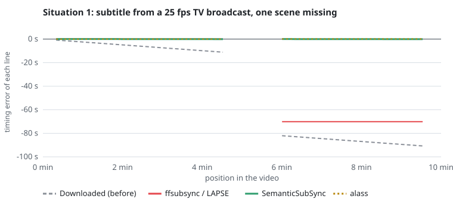
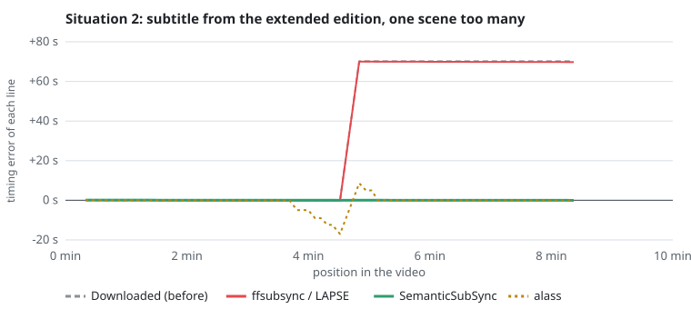

# Example: the lighthouse

A 10-minute dialogue written for this project (two people repairing an old radio in a lighthouse
during a storm), so that the example can be shared freely. It plays the part of an episode:

- `reference.*.srt` is the subtitle embedded in the video, in sync. It is in English, with
  hearing-impaired sound cues such as `[thunder]`.
- `downloaded.fr.srt` is the French subtitle downloaded for it, made for another release. Like
  a real translation, it has its own line breaks: two short replies in one cue, some long
  sentences in two.
- `truth.fr.srt` is the same French, timed as it should be on the video. It is only used to
  score the results.

| Folder | Situation | Expected result |
|---|---|---|
| [`1-missing-scene`](1-missing-scene) | The French was timed on a 25 fps TV broadcast (the video is 23.976 fps) that lacks a 70-second scene: it drifts, then jumps | Corrected |
| [`2-extra-scene`](2-extra-scene) | The other way round: the French was timed on the extended edition, the video is the shorter cut; every line after the extra scene is 70 s late | Corrected |
| [`3-wrong-reference`](3-wrong-reference) | The French of situation 1, but the reference is the director's commentary track: in sync with the video, but it says something else | Refused |

## Results

Same files for every tool, each given the reference subtitle. A line is right when it starts
within 300 ms of its true position.

| Tool | 1. Missing scene + 25 fps | 2. Extra scene | 3. Wrong reference |
|---|---|---|---|
| Downloaded file (before) | 0 %, up to 91 s off | 52 %, up to 70 s off | |
| alass 2.0.0 | ✅ 100 % | ❌ 87 %, up to 17 s off | ❌ changes the file (lines moved by up to 96 s) |
| ffsubsync 0.5.1 | ❌ 52 %, 70 s off | ❌ 52 %, 70 s off | ❌ changes the file (up to 36 s) |
| ffsubsync 0.5.1 `--split-penalty 5` | ❌ 52 %, 81 s off | ❌ 52 %, 61 s off | ❌ changes the file (up to 96 s) |
| LAPSE 2.2.3 | ❌ 52 %, 70 s off, verdict "solid" | ❌ 52 %, 70 s off, verdict "solid" | ❌ changes the file (up to 75 s), verdict "solid" |
| **SemanticSubSync 0.9.0** | ✅ **100 %** | ✅ **100 %** | ✅ **refused, file left alone** |





What the charts show:

- **ffsubsync and LAPSE** find one global correction (here the frame rate) and apply it to the
  whole file. Everything after the cut stays off by the length of the scene.
- **alass** handles one cut, but around the extra scene of situation 2 it places 11 lines
  between 5 and 17 s off.
- **Every other tool** changes the file when given the commentary track, without warning.
  LAPSE even rates its output "solid".
- **SemanticSubSync** reads what the lines say. A scene missing on either side is just a place
  where the matches jump, and a reference that says something else gives almost no matches,
  hence the refusal.

## Run it yourself

```bash
python examples/lighthouse/make_example.py                     # rebuilds the .srt files (deterministic)
semantic-subsync examples/lighthouse/1-missing-scene/downloaded.fr.srt \
                 examples/lighthouse/1-missing-scene/reference.en.srt
uv run --extra model python examples/lighthouse/compare.py     # every tool found on PATH
uv run python examples/lighthouse/plot.py examples/lighthouse/1-missing-scene chart.svg "Situation 1"
```

`compare.py` runs the tools it finds on the PATH (`alass-cli` or `alass`, `ffsubsync`, `lapse`)
and skips the missing ones.
